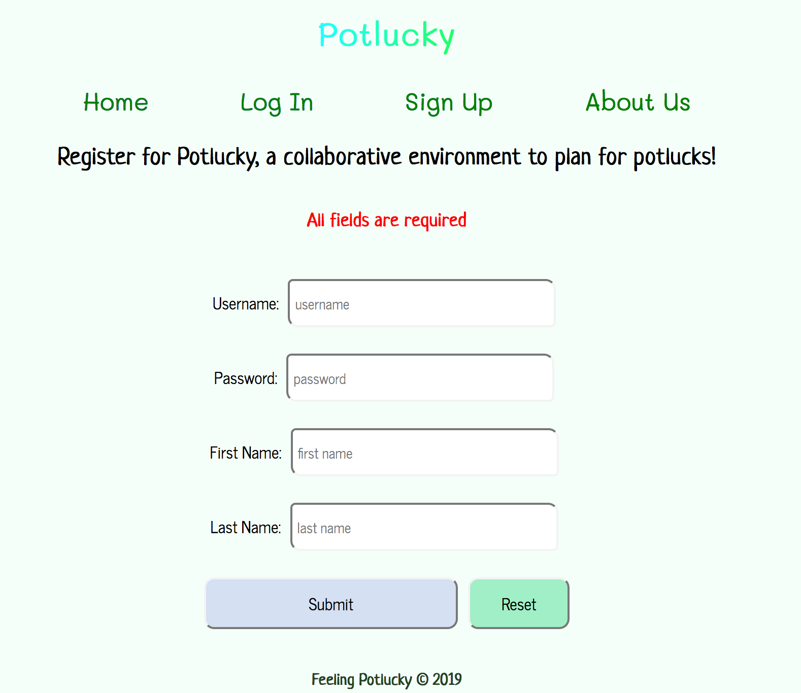
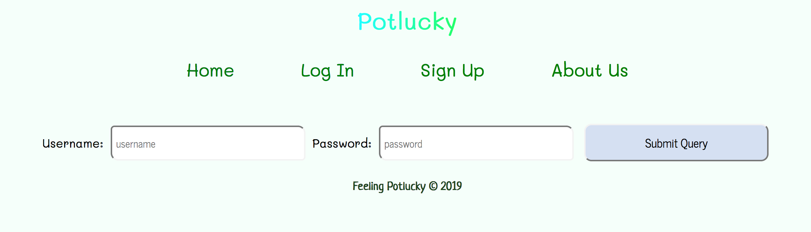
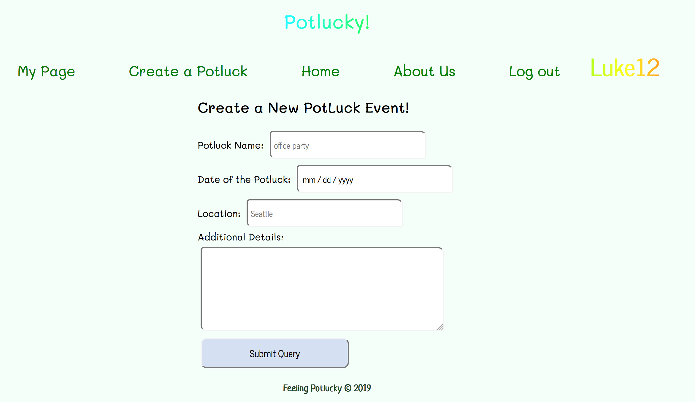
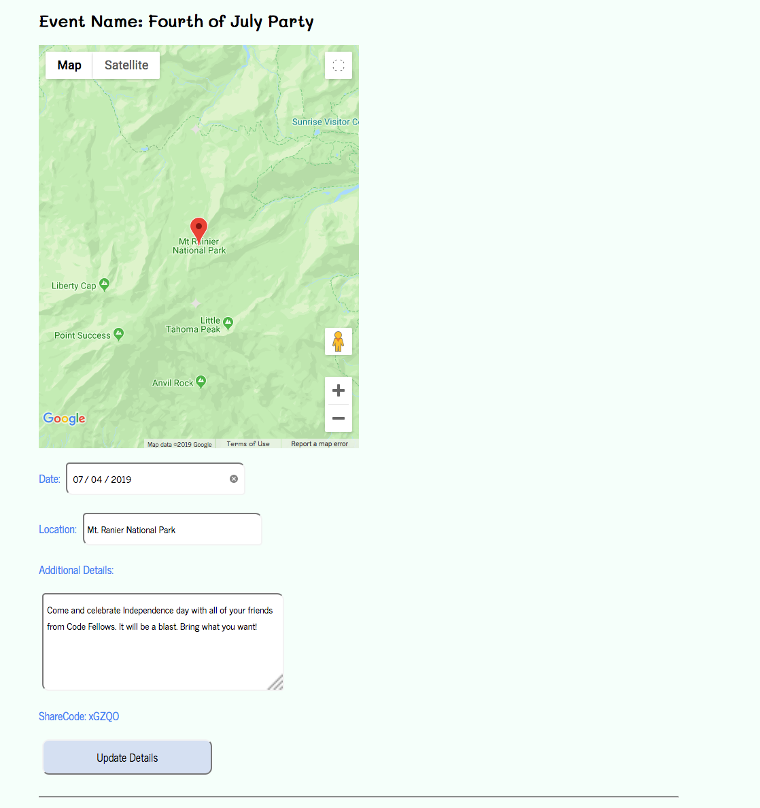
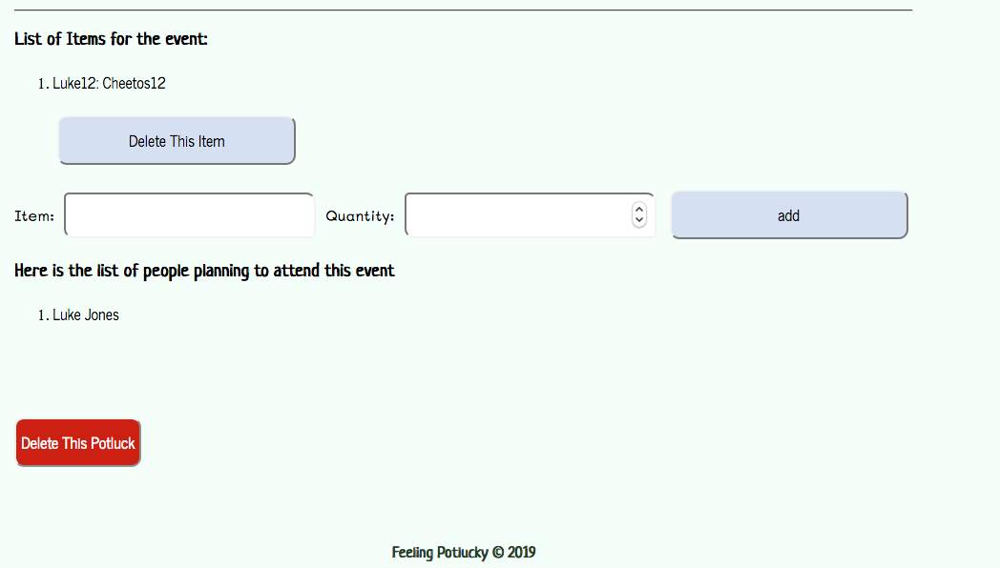

# Potlucky
> **Are you feeling potlucky? Collaborate with others to prepare for a potluck.**


## Table of Contents
* [Purpose](#purpose)
* [Summary](#summary)
* [Deployed Link](#deployed-link)
* [Notes](#notes)
* [Clone and Run Locally](#directions-to-clone-and-run-locally)
* [Screen Shots](#screen-shots)
* [Versions](#versions)
* [Creators](#creators)
* [License](#license)


## Purpose 
The purpose of this website is to avoid the problems associated with organizing and executing a successful
 potluck. Users are able to create a potluck event and share a code (invite people) that allows other users 
 to see and edit the event (change the name, location, date, items) as well as delete capabilities (delete items
 or even delete the potluck event). Web app assists in potluck planning collaboration. Users can also view the 
 location of the potluck by utilizing the Google Maps API (map satelite views are available as well as zoom in and 
 zoom out).  

## Summary
+ Create an account.
+ Login capabilities after account creation
+ Create a potluck event.
+ Share your code (to invite attendees).
+ Users can choose whether or not they want to attend an event they have the code for.
+ Collaborate to make a list of who is bringing what to the potluck.
+ Potluck creator can edit the location, date, description, and other details of the potluck.
+ Potluck creator can choose to delete the event if desired.
+ The person who has added an item to the list can either edit or delete the item.
 
## Deployed Link
+ http://potlucky.us-east-2.elasticbeanstalk.com/

## Notes
+ Technologies used:
    + Spring
    + Java-based 
    + PSQL
    + Google Maps API 
    + Junit
    + AWSEBCLI
    + Amazon Web Services
        - RDS
        - EB
        - EC2
        - S3

## Directions to Clone and Run Locally
+ CD into the desired directory on your local machine and clone the repo by typing the following in your terminal:
```
 $ git clone https://github.com/xialiu1988/PotLucky.git
```

+ Link for cloning the repo can be found from [Potlucky Repo](https://github.com/xialiu1988/PotLucky)
+ Set up a potlucky database locally.
    + In the terminal: ``$ psql``
    + You may need to type your password
    + Then in the terminal: ``$ CREATE DATABASE potlucky;``
+ Open the code on your desired IDE.
+ You will need a Google Maps API key (referred to GEOCODE_API_KEY in application and environment variables).
+ Put your Google API key into the environment variables
    + If using ItelliJ IDEA, this is found in the PotluckPlannerApplication dropdown and clicking Edit Configurations, then 
Environment variables: field.
+ If you are not using a Mac, then you will likely need your postgres username and password. 
    + These can also be entered in under environment variables. In the case of this application, 
    we used POSTGRES_USERNAME and POSTGRESS_PASSWORD in the application.properties file
+ Run the application 
    + In the terminal this is done by typing the following command:
    ``
    $ ./gradlew bootRun
    ``
+ The application is running on port 5000 by default (in the application.properties file), so 
in your browser type:
`` http://localhost:5000 ``

## Screen Shots 
+ Home Page

+ Sign Up

+ Log In

+ Create a Potluck

+ Potluck Details

+ Items and Attendees



## Versions:
> Version 1.0.0  06/24/19

## Creators
> **Jen Shin**  [gitHub](https://github.com/jshin83)

> **Luke Chandler**  [gitHub](https://github.com/lhchandler4)

> **Roger Huba**  [gitHub](https://github.com/rogerhuba)

> **Xia Liu**  [gitHub](https://github.com/xialui1988)


## License
> This project is licensed under the MIT License - see the [License](https://choosealicense.com/licenses/mit/) file for details.
